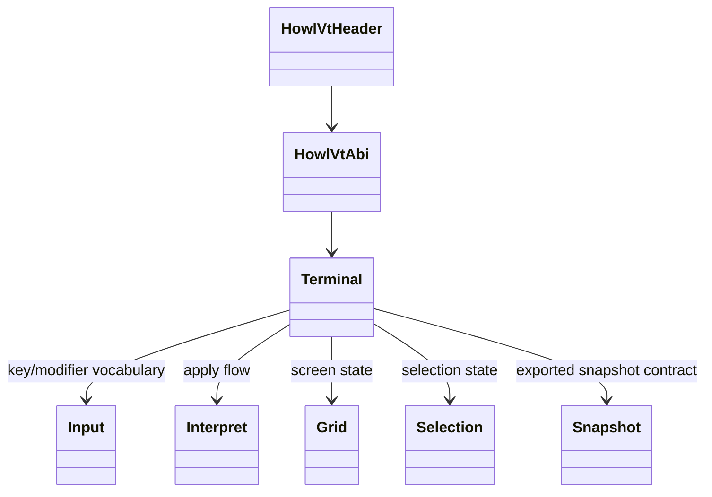
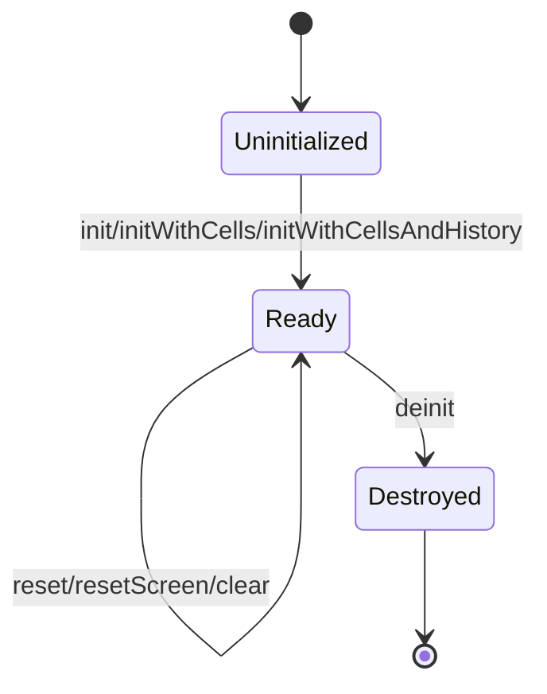
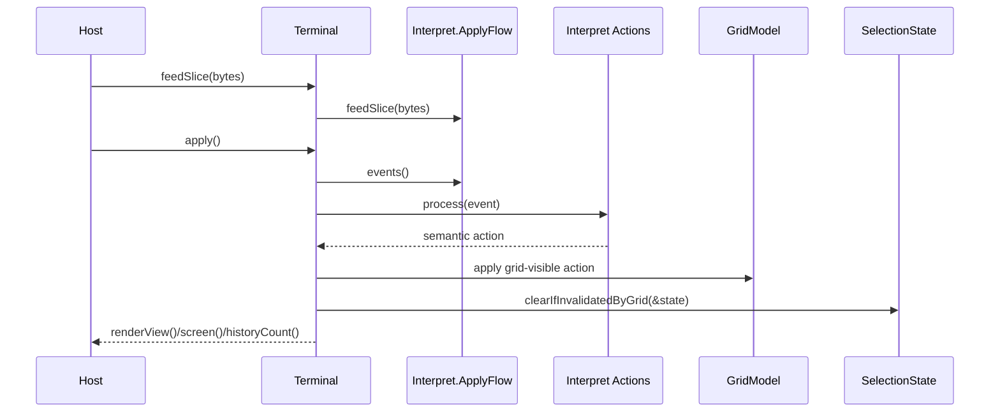
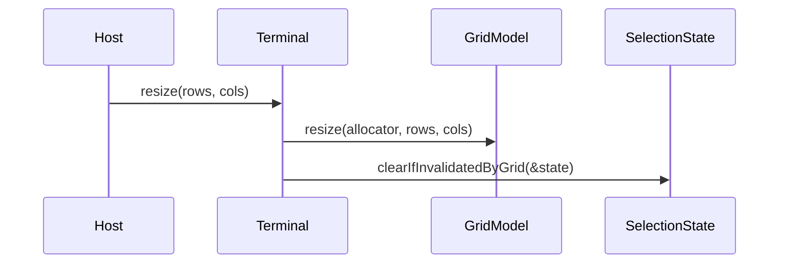

# Design

Shared rules: [`../design/design-rules.md`](../design/design-rules.md)

## Purpose
`howl-vt` owns the host-neutral terminal model.

It parses terminal input streams, maps parser events into terminal actions, applies grid state, tracks selection and snapshots, and exposes render-facing and host-output-facing surfaces.

## Doc Set
- `design.md`: owner boundary, file rules, and ABI contract.
- `protocol_matrix.md`: protocol ledger summary, queries, and support table.

## Public Surface
- `include/howl_vt.h`: C ABI header.
- `howl_vt_*` exported symbols: C ABI contract for terminal runtime calls only.
- The shipped embedding boundary is C ABI only.
- `src/howl_vt.zig` is not an embedding surface. If it survives, it is repo-local only.
- Internal workspace wiring is not a public contract and is not a preservation target.
- Accepted cleanup result so far is exact:
  - `src/vt_namespace.zig` is deleted
  - `src/libhowl_vt.zig` is the explicit ABI export root
  - `include/howl_vt.h` carries explicit vocabulary constants instead of exported getter helpers
  - `HowlVtHandle` is an opaque pointer handle contract
  - Linux host consumes explicit VT ABI steps only
  - repo-local terminal and input convenience posture that mirrored deeper owners or old ABI shape is removed

## Ownership Rules
- `src/howl_vt.zig` is repo-local only. It is not a host integration surface and must not regrow one.
- `Terminal` owns lifecycle, apply-flow orchestration, grouped screen/mode/host/kitty state, and the terminal implementation facade behind the C ABI.
- `Input` owns key, modifier, mouse, host-token parsing, and input encoding vocabulary.
- `Interpret` owns parser-event buffering and parser-event-to-action mapping.
- `Grid` owns screen, cursor, edit, erase, scrollback, style, dirty, tab, margin, and rectangular mutation state.
- `Grid` treats scrollback truth as logical lines; history rows exposed to hosts and snapshots are width-dependent projections.
- `Selection` owns selection state and validity against grid mutations.
- `Snapshot` owns exported snapshot shapes only.
- `ParserApi` owns byte-stream parsing contracts used by interpret, tests, and fuzzing.
- Protocol syntax, parser-event shape, action meaning, grid mutation, and terminal host consequences must stay in separate owners.

## File Rules
- `src/parser/` recognizes syntax only.
- `src/interpret/parser_events.zig` owns parser-event buffering and transport into interpret.
- `src/interpret/*_actions.zig` owns protocol meaning by family.
- `src/grid/` owns grid mutation only.
- `src/terminal/` owns host-facing consequences only.
- `src/input/` keeps key, mouse, token, and encoding owners separate.
- `src/terminal.zig` stays a facade owner.
- `protocol_coverage.db` is the protocol source of truth. `unit_test_filters` must stay executable.
- New protocol work defines syntax, parser event shape, action meaning, state mutation, and proof before code lands.
- Normal proof is focused tests plus `zig build test`.

## Lifecycle

## Main Flows
### Parse And Apply

### Resize

## API Contracts
- The public compatibility promise is the C ABI only.
- `include/howl_vt.h` and `howl_vt_*` exported symbols define the product surface.
- Hosts and embedders consume `howl-vt` through that header and those exported symbols only.
- Zig root imports are not an acceptable host integration path and are not a preservation target.
- `howl_vt_terminal_init` and `howl_vt_terminal_deinit` own opaque terminal-handle lifecycle.
- `howl_vt_terminal_feed`, `howl_vt_terminal_apply`, and `howl_vt_terminal_resize` cover bounded parser/apply/geometry control.
- `howl_vt_terminal_copy_visible` is the host-visible bulk state seam for cursor, scrollback metadata, and visible cells.
- `howl_vt_terminal_copy_pending_output`, `howl_vt_terminal_clear_pending_output`, and `howl_vt_terminal_drain_pending_clipboard` cover host-facing protocol consequences.
- `howl_vt_terminal_encode_key`, `howl_vt_terminal_encode_focus`, `howl_vt_terminal_encode_mouse`, and `howl_vt_terminal_encode_paste` cover host input encoding against current terminal modes.
- Header-declared key, modifier, and mouse constants are part of the shipped vocabulary contract. Getter and validator helper exports are not.
- Zig owner names may change as long as the C ABI contract stays stable.

## Repo-Local Surface
- `src/terminal.zig` may expose owner APIs for tests, fuzzers, and internal seams only when they describe true owned state or mutation.
- Repo-local callers should consume visible terminal state through `visibleView` instead of convenience getters that restate fields already carried there.
- Repo-local callers should consume queued apply state through `applyLimit` instead of separate queue-depth helpers.
- `src/input.zig` owns vocabulary types and constants. It should not act as a namespace bag for deeper owner modules.
- Checkpoint 4 accepted result:
  - repo-local queue, title, history, and alternate-screen convenience getters were removed in favor of `applyLimit` and `visibleView`
  - repo-local token parsing no longer pretends to be owned by `Terminal`
  - repo-local input namespace bag posture was removed

## Internal Invariants
- The implementation still follows the same internal runtime invariants:
  - `init*` returns owned terminal state
  - `feedByte` and `feedSlice` queue parser work only
  - `apply` mutates terminal state and resolves queued host-facing protocol output
  - `resize` preserves terminal semantics while updating visible geometry
  - selection validity is rechecked after grid-affecting operations

## Non-Goals
- PTY ownership.
- Host windowing.
- GPU rendering.
- Font loading or rasterization.

## Change Rules
- New visible-state concepts must have a named owner before code is added.
- Parser syntax must not own terminal meaning.
- Interpret action owners must not mutate grid or host state directly.
- Grid mutation owners must not know protocol families.
- `Terminal` boundary owners must keep host consequences explicit.
- Hosts should depend on the C ABI, not deep parser/grid leaves.
- Update `protocol_coverage.db` and test filters with the same change that adds protocol behavior.
