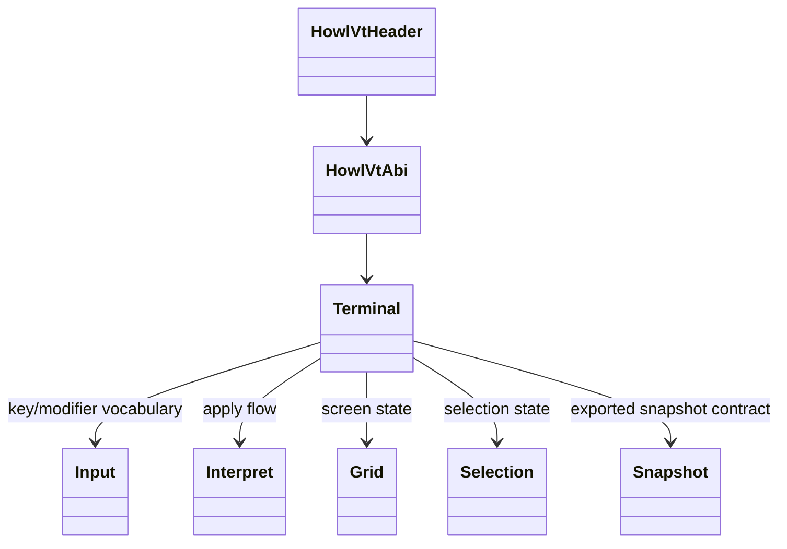
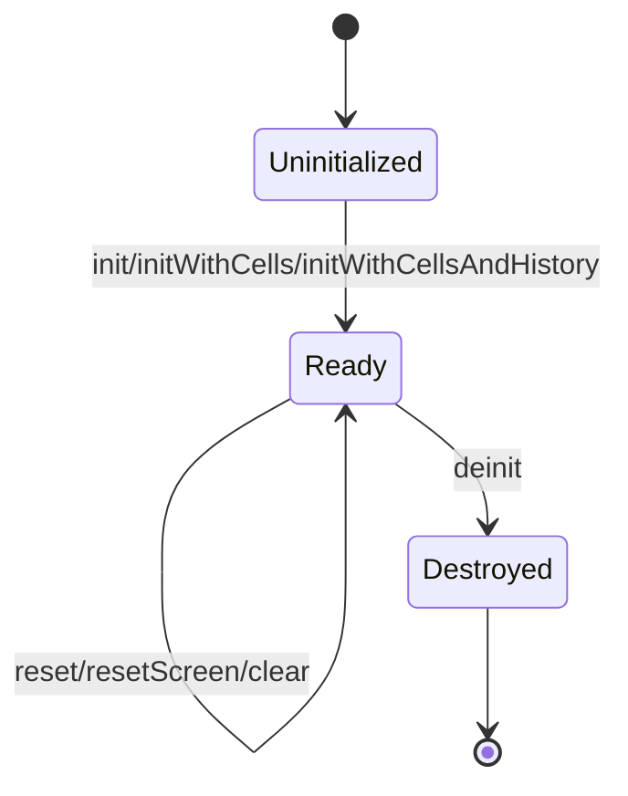
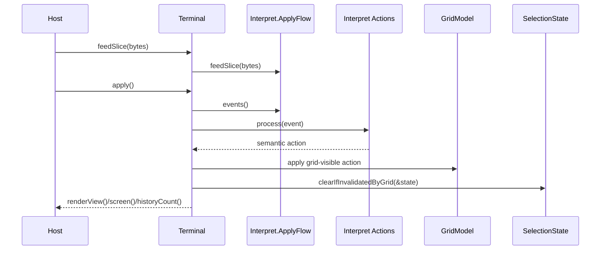
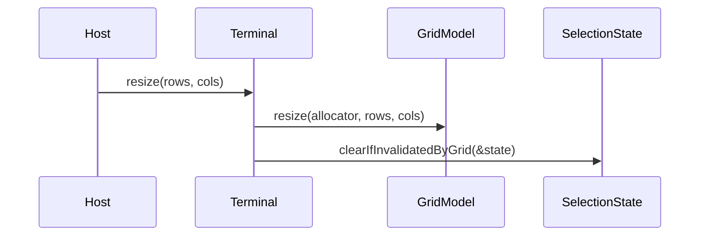

# Design

Shared rules: [`../design/design-rules.md`](../design/design-rules.md)

## Purpose
`howl-vt` owns the host-neutral terminal model.

It parses terminal input streams, shapes parser events, maps those events into terminal actions, applies actions to grid and boundary state, tracks selection and snapshots, and exposes stable render-facing and host-output-facing surfaces.

Architecture drift rules: [`ARCHITECTURE_CLEANUP.md`](ARCHITECTURE_CLEANUP.md)

## Public Surface
- `include/howl_vt.h`: C ABI header.
- `howl_vt_*` exported symbols: C ABI contract for input vocabulary and terminal runtime calls.
- No public Zig API is promised. Root Zig exports exist for internal workspace wiring only.

## Ownership Rules
- `src/howl_vt.zig` owns the C ABI export root and internal root-module assembly only.
- `Terminal` owns lifecycle, apply-flow orchestration, grouped screen/mode/host/kitty state, and the terminal implementation facade behind the C ABI.
- `Input` owns key, modifier, mouse, host-token parsing, and input encoding vocabulary.
- `Interpret` owns parser-event buffering and parser-event-to-action mapping.
- `Grid` owns screen, cursor, edit, erase, scrollback, style, dirty, tab, margin, and rectangular mutation state.
- `Grid` treats scrollback truth as logical lines; history rows exposed to hosts and snapshots are width-dependent projections.
- `Selection` owns selection state and validity against grid mutations.
- `Snapshot` owns exported snapshot shapes only.
- `ParserApi` owns byte-stream parsing contracts used by interpret, tests, and fuzzing.
- Protocol syntax, parser-event shape, action meaning, grid mutation, and terminal host consequences must stay in separate owners.

## Lifecycle

## Main Flows
### Parse And Apply

### Resize

## API Contracts
- The public compatibility promise is the C ABI only.
- `include/howl_vt.h` and `howl_vt_*` exported symbols define the product surface.
- `howl_vt_terminal_init` and `howl_vt_terminal_deinit` own opaque terminal-handle lifecycle.
- `howl_vt_terminal_feed`, `howl_vt_terminal_apply`, and `howl_vt_terminal_resize` cover bounded parser/apply/geometry control.
- `howl_vt_terminal_copy_visible` is the host-visible bulk state seam for cursor, scrollback metadata, and visible cells.
- `howl_vt_terminal_copy_pending_output`, `howl_vt_terminal_clear_pending_output`, and `howl_vt_terminal_drain_pending_clipboard` cover host-facing protocol consequences.
- `howl_vt_terminal_encode_key`, `howl_vt_terminal_encode_focus`, `howl_vt_terminal_encode_mouse`, and `howl_vt_terminal_encode_paste` cover host input encoding against current terminal modes.
- Zig owner names may change as long as the C ABI contract stays stable.
- The implementation still follows the same internal runtime invariants:
  - `init*` returns owned terminal state
  - `feedByte` and `feedSlice` queue parser work only
  - `apply` mutates terminal state and resolves queued host-facing protocol output
  - `resize` preserves terminal semantics while updating visible geometry
  - selection validity is rechecked after grid-affecting operations

## Non-Goals
- PTY ownership.
- Host windowing.
- GPU rendering.
- Font loading or rasterization.

## Change Rules
- New visible-state concepts must have a named owner before code is added.
- Parser syntax must not own terminal meaning.
- Interpret action owners must not mutate grid or host state directly.
- Grid mutation owners must not know protocol families.
- `Terminal` boundary owners must keep host consequences explicit.
- Hosts should depend on the C ABI, not deep parser/grid leaves.
- Update `protocol_coverage.db` and test filters with the same change that adds protocol behavior.
