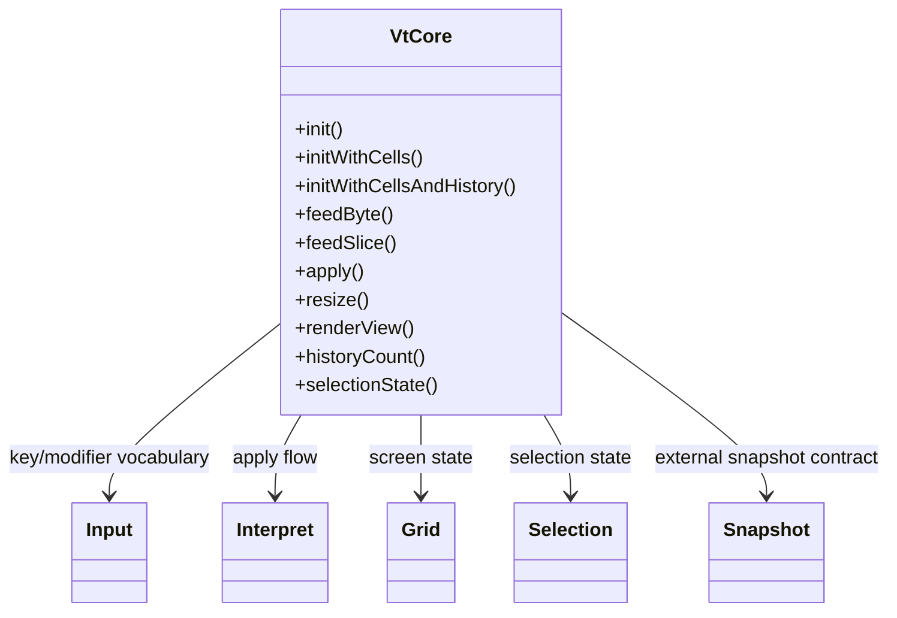
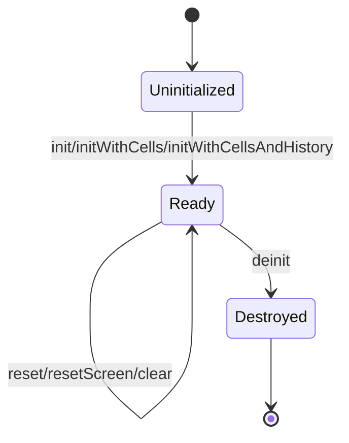
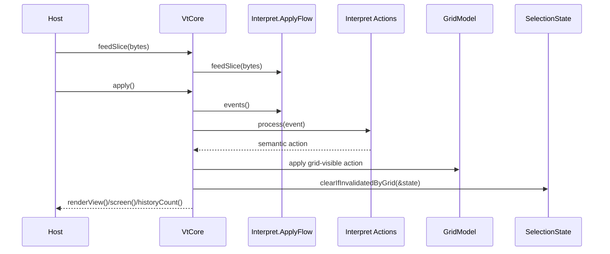
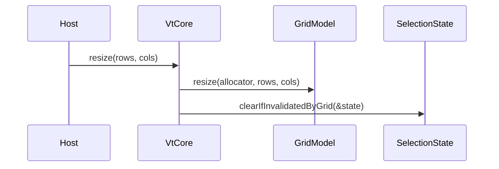

# Design

Shared rules: [`../design/design-rules.md`](../design/design-rules.md)

## Purpose
`howl-vt-core` owns the host-neutral terminal model.

It parses terminal input streams, shapes parser events, maps those events into terminal actions, applies actions to grid and boundary state, tracks selection and snapshots, and exposes stable render-facing and host-output-facing surfaces.

Architecture drift rules: [`ARCHITECTURE_CLEANUP.md`](ARCHITECTURE_CLEANUP.md)

## Public Surface
- `VtCore`: main runtime owner.
- `Input`: input domain owner.
- `Interpret`: interpret domain owner.
- `Grid`: grid domain owner.
- `Selection`: selection domain owner.
- `Snapshot`: snapshot domain owner.

## Ownership Rules
- `VtCore` owns lifecycle, apply-flow orchestration, grouped screen/mode/host/kitty state, and the public terminal facade.
- `Input` owns key, modifier, mouse, host-token parsing, and input encoding vocabulary.
- `Interpret` owns parser-event buffering and parser-event-to-action mapping.
- `Grid` owns screen, cursor, edit, erase, scrollback, style, dirty, tab, margin, and rectangular mutation state.
- `Grid` treats scrollback truth as logical lines; history rows exposed to hosts and snapshots are width-dependent projections.
- `Selection` owns selection state and validity against grid mutations.
- `Snapshot` owns exported snapshot shapes only.
- `ParserApi` owns byte-stream parsing contracts used by interpret, tests, and fuzzing.
- Protocol syntax, parser-event shape, action meaning, grid mutation, and vt-core host consequences must stay in separate owners.

## Lifecycle

## Main Flows
### Parse And Apply

### Resize

## API Contracts
- `init*` returns an owned `VtCore`; caller must later call `deinit`.
- `feedByte` and `feedSlice` queue parser work only; they do not apply it to the grid.
- `apply` is the boundary that mutates screen state and resolves any queued host-facing protocol output.
- `renderView` returns a stable read-only projection for rendering.
- `resize` preserves terminal semantics while updating visible geometry.
- `historyCapacity` limits retained logical history lines; projected history row count may exceed that when narrow widths rewrap those lines.
- Selection validity is rechecked after grid-affecting operations.

## Non-Goals
- PTY ownership.
- Host windowing.
- GPU rendering.
- Font loading or rasterization.

## Change Rules
- New visible-state concepts must have a named owner before code is added.
- Parser syntax must not own terminal meaning.
- Interpret action owners must not mutate grid or host state directly.
- Grid mutation owners must not know protocol families.
- `VtCore` boundary owners must keep host consequences explicit.
- Hosts should depend on `VtCore`, not deep parser/grid leaves.
- Update `protocol_coverage.db` and test filters with the same change that adds protocol behavior.
